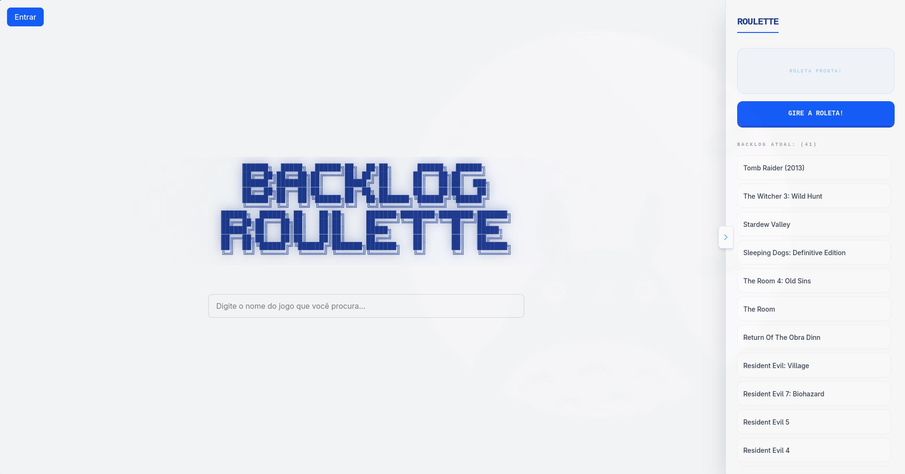

# Backlog Roulette
Projeto que eu fiz para conseguir sortear melhor qual é o próximo jogo que vou jogar, como eu tenho muitos jogos separados em emuladores, steam e outras plataformas, resolvi fazer esse pequeno projeto para ter uma roleta que captura os jogos pela API da RAWG e agrupa todos.

## Tela Inicial:

Todo o projeto foi feito usando Typescript, o banco de dados é uma instância do Postgres do Supabase, aberta a todos.

## Tela de Adição de Jogo a Roleta:

